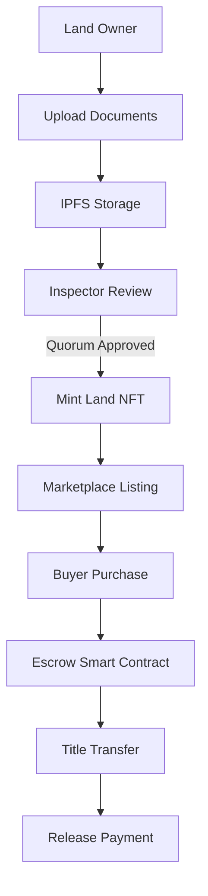

# 🏡 BIMA — Reimagining Land Ownership on Mantle

> **Mantle Hackathon Track — Trust, Transparency, and Tokenized Land for the Real World**

[](https://www.mantle.xyz)
[](https://soliditylang.org)
[](https://book.getfoundry.sh)
[](LICENSE)

---

## 🌍 Vision

**BIMA** is a decentralized land marketplace designed for places where land matters most — and trust is hardest to guarantee.

We combine **tokenized land titles**, **decentralized identities (DIDs)**, and **human accountability** to create a system where land ownership is:

* **Provable on-chain**
* **Verified by real, known people**
* **Transferable without corruption or bureaucracy**

Built on **Mantle**, BIMA leverages low fees, fast finality, and Ethereum compatibility to make land markets finally work for everyday people.

> *BIMA bridges blockchain certainty with community trust.*

---

## 🚨 The Problem

Across emerging markets, land ownership is fragile:

* Paper titles are forged, duplicated, or lost
* Central registries are opaque or corrupt
* Buyers cannot verify legitimacy
* Sellers cannot prove ownership
* Local officials lack accountability

**The result:** disputes, fraud, frozen capital, and generational insecurity.

---

## 💡 The BIMA Solution

BIMA transforms land into a **living on-chain asset**.

Every parcel becomes an **ERC-721 Land Title NFT** with a verifiable history. Every interaction — listing, inspection, payment, and transfer — is recorded on **Mantle’s public ledger**.

But BIMA goes further.

### 👥 Human Trust, On-Chain

BIMA introduces a powerful role: **Inspectors**.

Inspectors are **real, identifiable community authorities**:

* Local chiefs
* Licensed surveyors
* Government land officers

They are not anonymous wallets — they are people users can **see, meet, and hold accountable**.

A land title can only be minted or transferred after **multi-inspector verification**.

---

## 🔄 How BIMA Works



---

## 🧠 Core Concepts

### 🏷️ Land Title NFTs

* ERC-721 compliant
* One NFT = one verified land parcel
* Immutable ownership history
* Metadata includes location, size, documents, and verification status

### 🆔 Decentralized Identities (DIDs)

* Every user has a verifiable identity
* Prevents impersonation and Sybil attacks
* Enables role-based permissions

### 👁️ Inspector Verification

* Multi-signature approval model
* No single authority can mint or transfer land
* Inspectors earn on-chain reputation

### 💰 Escrowed Payments

* Buyer funds locked in smart contract
* Released only after verified title transfer
* Eliminates counterparty risk

---

## 🛠️ Tech Stack

### Blockchain & Smart Contracts

* **Mantle Network (Sepolia)**
* **Solidity (0.8.x)**
* **OpenZeppelin Contracts**
* **Foundry (forge & cast)**

### Storage & Identity

* **IPFS** for documents and metadata
* **DID-compatible identity layer**

### Frontend

* **Next.js + React**
* **Ethers.js**
* **WalletConnect / MetaMask**

---

## 🏗️ System Architecture

```
┌──────────────┐        ┌────────────────┐        ┌──────────────┐
│   Frontend   │◄──────►│ Smart Contracts│◄──────►│ Mantle Chain │
│  (Next.js)   │        │  (Solidity)    │        │ (L2 Network) │
└──────┬───────┘        └──────┬─────────┘        └──────┬───────┘
       │                        │                           │
       ▼                        ▼                           ▼
┌──────────────┐        ┌────────────────┐        ┌──────────────┐
│   Wallets    │        │     IPFS       │        │   Explorer   │
│ MetaMask etc │        │ Land Documents │        │ MantleScan   │
└──────────────┘        └────────────────┘        └──────────────┘
```

---

## 🚀 Deployment (Foundry)

### Environment

```bash
MANTLE_RPC=https://rpc.sepolia.mantle.xyz
MANTLE_CHAIN_ID=5003
PRIVATE_KEY=YOUR_PRIVATE_KEY
```

### Deploy

```bash
forge script script/DeployBima.s.sol \
  --rpc-url $MANTLE_RPC \
  --chain-id 5003 \
  --private-key $PRIVATE_KEY \
  --broadcast \
  --verify
```

---

## ✨ Key Features

* ✅ Tokenized land titles (ERC-721)
* ✅ Inspector-based multi-sign verification
* ✅ Escrow-protected land purchases
* ✅ Full on-chain audit trail
* ✅ Low-cost transactions via Mantle
* ✅ Real-world accountability

---

## 🌍 Impact

| Metric             | Traditional  | BIMA       |
| ------------------ | ------------ | ---------- |
| Title Verification | Weeks–Months | Hours–Days |
| Fraud Risk         | High         | Near-zero  |
| Transfer Cost      | $100–$500    | Minimal    |
| Transparency       | Opaque       | Public     |

BIMA unlocks:

* Safer land markets
* Higher investment confidence
* Reduced disputes
* Stronger property rights

---

## 📊 Hackathon Progress

* Smart contract MVP completed
* Inspector verification implemented
* Escrow purchase flow working
* Deployed on Mantle Sepolia
* Demo-ready

---

## 👥 Team

| Name          | Role                    |
| ------------- | ----------------------- |
| John Mokaya   | Frontend Developer      |
| Mary Njoroge  | Project Manager         |
| Irene Njoroge | Smart Contract Engineer |
| Joseph Okumu  | Backend Engineer        |

---

## 📄 License

MIT License © BIMA

---

<div align="center">

**BIMA — Land You Can Trust**

Built with ❤️ on Mantle

</div>
