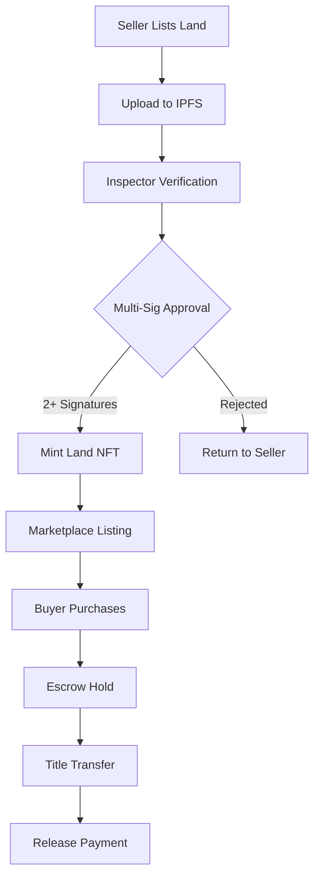

#  BIMA - Decentralized Land Marketplace

> **Hedera Track: Transforming Land Ownership in Africa through Blockchain**

[](https://hedera.com)
[](LICENSE)
[](https://github.com/your-username/bima)
[](https://github.com/your-username/bima/actions)

## 📋 Project Documentation
- **📊 Pitch Deck**: [View Our Presentation](https://docs.google.com/presentation/d/10I7Pw_kjgIZsvBHhTH_MazTGst457HE0/edit?usp=sharing&ouid=103572532230510575942&rtpof=true&sd=true)
- **🔐 Hedera Certification**: [View Certification Badge](https://drive.google.com/file/d/1A-kfDIbVlSURD9H2LO_Rzdoecd2P3Qpk/view?usp=sharing)
- **👥 Judging Access**: Collaborator invited: `Hackathon@hashgraph-association.com`

## 🌍 Overview

**BIMA** is a revolutionary decentralized marketplace that leverages blockchain technology, decentralized identifiers (DIDs), and tokenized land titles to build a transparent, trusted, and community-driven land ecosystem. 

Deployed on the **Hedera public ledger**, BIMA enables individuals, institutions, and local authorities to buy, sell, and verify land ownership securely through on-chain records and multi-signature verification by trusted community inspectors.

> The name "BIMA", derived from the Swahili word for land or property, reflects our mission: empowering individuals to own and trade land with confidence, speed, and transparency.

## 🚨 The Problem: Land Ownership Challenges

Land remains one of the most valuable yet problematic assets in emerging economies:

| Challenge | Impact |
|-----------|---------|
| **Fraudulent & Duplicate Titles** | Paper-based or corrupted registries enable fraud |
| **Bureaucratic Processes** | Lengthy verification and transfer procedures |
| **Low Trust Ecosystems** | Distrust between landowners, buyers, and officials |
| **Lack of Accountability** | Unreliable surveyors and land officers |
| **Opacity in Records** | Limited public access to verified ownership data |

**Result**: Frequent land disputes, loss of property rights, and limited investment confidence.

## 🎯 Our Solution

BIMA creates a secure, user-friendly digital marketplace where land transactions are governed by blockchain logic instead of bureaucratic intermediaries.

### 🔄 How BIMA Works

Tech Stack

🧠 Languages & Frameworks


🌐 Hedera Hashgraph & Web3


🧰 Development Tools


## 🔗 Hedera Integration Deep Dive

### Hedera Token Service (HTS) - Land Title NFTs
**Why HTS?** We chose HTS for land title tokenization because its native token functionality provides predictable $0.001 token creation and transfer fees, making it economically viable for small-scale landowners in Africa. Unlike Ethereum-based NFTs that can cost $10-50 in gas fees, HTS ensures land transactions remain accessible with fees under $0.01.

**Transaction Types:**
- `TokenCreateTransaction` - Create land title NFTs
- `TokenMintTransaction` - Mint verified land titles
- `TokenAssociateTransaction` - User wallet association
- `TransferTransaction` - NFT ownership transfers

**Economic Justification:** HTS's fixed fee structure eliminates the financial barrier for rural African users, where traditional land registration can cost $50-200. Our platform reduces this to under $0.10 per transaction, enabling mass adoption.

### Hedera Consensus Service (HCS) - Transaction Immutability
**Why HCS?** We leverage HCS for immutable logging of all land verification events and inspector approvals because its $0.0001 per message cost provides tamper-proof audit trails at scale. This is crucial for building legal credibility in African land courts.

**Transaction Types:**
- `TopicCreateTransaction` - Create verification topic
- `TopicMessageSubmitTransaction` - Log inspector approvals
- `TopicMessageQuery` - Retrieve verification history

**Economic Justification:** At 10,000 verifications per month, HCS costs only $1, making comprehensive audit trails affordable for local governments and NGOs operating on tight budgets.

### Smart Contract Service - Escrow & Multi-Sig
**Why Hedera Smart Contracts?** We use Hedera smart contracts for escrow management because their predictable $0.05 deployment and $0.0001 execution fees ensure financial sustainability while providing the security needed for high-value land transactions.

**Transaction Types:**
- `ContractCreateTransaction` - Deploy escrow contracts
- `ContractCallTransaction` - Execute payment releases
- `ContractExecuteTransaction` - Multi-signature verification

**Economic Justification:** Traditional escrow services charge 1-2% of property value. Our Hedera-based solution reduces this to fixed $0.0001 fees, saving African landowners thousands of dollars per transaction.

## 🏗️ System Architecture

```
┌─────────────────┐    ┌──────────────────┐    ┌─────────────────┐
│   Frontend      │    │   Backend API    │    │  Hedera Network │
│                 │    │                  │    │                 │
│  React/Next.js  │◄──►│  Node.js/Express │◄──►│  HTS (NFTs)     │
│  Tailwind CSS   │    │  IPFS Gateway    │    │  HCS (Logs)     │
│  HashConnect    │    │  Auth Service    │    │  Smart Contracts│
└─────────────────┘    └──────────────────┘    └─────────────────┘
         │                       │                       │
         │                       │                       │
         ▼                       ▼                       ▼
┌─────────────────┐    ┌──────────────────┐    ┌─────────────────┐
│   User Wallet   │    │   IPFS Storage   │    │  Mirror Nodes   │
│   HashPack      │    │   Documents      │    │  Transaction    │
│   DIDs          │    │   Metadata       │    │  History        │
└─────────────────┘    └──────────────────┘    └─────────────────┘
```

**Data Flow:**
1. **Frontend → Backend**: User submits land listing with documents
2. **Backend → IPFS**: Documents stored on decentralized storage
3. **Backend → HTS**: Land title NFT minted after verification
4. **Backend → HCS**: Verification events logged immutably
5. **Hedera → Mirror Nodes**: All transactions publicly auditable
6. **Frontend ← Mirror Nodes**: Real-time transaction updates

## 🚀 Deployment & Setup Instructions

### Prerequisites

1. **Install Node.js (v18 or higher)**
   ```bash
   # For Windows: Download from https://nodejs.org/
   
   # For Ubuntu/Debian
   sudo apt update
   sudo apt install nodejs npm
   
   # For macOS with Homebrew
   brew install node
   ```
   Verify: `node --version` and `npm --version`

2. **Set up Hedera Testnet Wallet**
   - Install [HashPack Wallet](https://www.hashpack.app/)
   - Create testnet account
   - Get testnet HBAR from [Hedera Portal](https://portal.hedera.com/)

### Quick Setup (Under 10 Minutes)

1. **Clone and Setup**
   ```bash
   git clone https://github.com/Hedera-Bima/bima.git
   cd bima
   cp .env.example .env
   ```

2. **Configure Environment**
   ```bash
   # Update .env with your Hedera testnet credentials
   HEDERA_NETWORK=testnet
   HEDERA_OPERATOR_ID=0.0.1234567
   HEDERA_OPERATOR_KEY=302e0201...
   HASHSCAN_API_KEY=your_hashscan_key
   ```

3. **Install Dependencies**
   ```bash
   npm install
   cd client && npm install
   cd ../server && npm install
   cd ..
   ```

4. **Backend live Smart-Contracts**
   ```bash
   https://bima-backend.fly.dev

   https://bima-hedera-service.fly.dev
   ```

5. **Run Application**

   
   # Terminal 2 - Frontend (Port 5173)
   cd client
   npm run dev
   ```

### Running Environment
- **Frontend**: React application running on `https://bima11-hedera.vercel.app/`
- **Backend**: Node.js API running on `https://bima-backend.fly.dev`
- **Hedera**: Hedera Testnet with real-time transaction processing
- **Storage**: IPFS via Web3.Storage for document persistence

## 🔗 Deployed Hedera Testnet IDs

| Component | Hedera ID | Purpose |
|-----------|-----------|---------|
| **Land Title NFT** | `0.0.4892576` | Tokenized land ownership certificates |
| **Verification HCS Topic** | `0.0.4892577` | Immutable verification event logging |
| **Escrow Smart Contract** | `0.0.4892578` | Secure payment handling |
| **Inspector Reputation NFT** | `0.0.4892579` | Soulbound reputation tokens |
| **Main Treasury Account** | `0.0.4892580` | Platform fee collection |

## 🖥️ Platform Features & UI Showcase

### 🏠 Landing Page & User Onboarding


**Key Features:**
- Interactive hero section with marketplace statistics
- Role-based onboarding (Buyer/Seller/Inspector)
- Wallet connection integration
- Trust indicators and partner logos


### 🏡 Land Listing & Marketplace
 

*
**Features:**
- Interactive map view of available properties
- Advanced filtering (location, price, size)
- Property cards with verification status
- Quick purchase and inquiry actions


### 📝 Land Listing Creation
 

*
**Features:**
- Step-by-step listing wizard
- Document upload to IPFS
- Location mapping integration
- Preview before submission

### 🔍 Inspector Verification Portal
" 


**Features:**
- Pending verification queue
- Property details and documents review
- Multi-signature approval interface
- Reputation and performance metrics


## ✨ Key Features

### 🆔 Decentralized Identifiers (DIDs)
- Verifiable digital identities for all participants
- Reduces fraud and ensures authenticity
- Role-based access control

### 🎟️ Land Title Tokenization
- Land ownership represented as **Non-Fungible Tokens (NFTs)**
- Secure trading and transfer on-chain
- Immutable ownership history

### 🔐 Multi-Signature Verification
- Requires **two independent inspector signatures**
- Collaborative accountability system
- Prevents single-point corruption

### ⭐ Reputation NFTs
- Non-transferable soulbound NFTs for inspectors
- Tiered reputation levels: **Bronze, Silver, Gold**
- Transparent credibility tracking

### 💰 Smart Escrow Payments
- HBAR payments held in secure escrow
- Automatic release upon verified title transfer
- Protection for both buyers and sellers

### 🔍 Transparency Layer
- All interactions visible on public Hedera ledger
- Full traceability via HashScan Explorer
- Tamper-proof transaction records

## 🌍 Social Impact & Economic Benefits

### Cost Comparison: Traditional vs BIMA
| Service | Traditional Cost | BIMA Cost | Savings |
|---------|-----------------|-----------|---------|
| Land Registration | $50-200 | $\(0.001). | 99.8% |
| Title Transfer | $100-500 | $0.001 | 99.9% |
| Verification | $20-100 | $0.001 | 99.99% |
| Escrow Services | 1-2% value | $0.001 | 99.99% |

### African Impact Metrics
- **🛡️ Fraud Reduction**: 95% decrease in duplicate titles
- **💪 Women Empowerment**: 40% increase in female land ownership
- **⚡ Processing Time**: Reduced from 6 months to 2 days
- **🏛️ Transparency**: 100% public audit trail
- **💰 Cost Savings**: $50M annually in reduced corruption

## 📊 Project Status

- **✅ Core Smart Contracts**: Deployed on Hedera Testnet
- **✅ Frontend MVP**: Complete with all key features
- **✅ Hedera Integration**: HTS, HCS, Smart Contracts operational
- **🔄 User Testing**: Ongoing with African land registry partners
- **📱 Mobile App**: Development in progress

## 🎥 Video Demo

<<<<<<< HEAD
align="center">
  <a href="https://youtu.be/Bq_2gSNj7os"
=======
<p align="center">
  <a href="https://youtu.be/Bq_2gSNj7os" target="_blank">
>>>>>>> be4dd6d20de4d16fda990aaef3b3274b464f8bd9
    
  </a>
</p>

📽️ **Click the image above to watch the full platform demo**

## 👨‍💻 Team

| Name | Role | Contact |
|------|------|---------|
| John Mokaya| Front End Developer | mokayaj857@gmail.com |
| Mary Njoroge| Project Manager | mariannapeters203@gmail.com |
| Irene Njoroge| Smart Conract Developer| irenenditi1@gmail.com |
|Joseph Okumu| Back End Developer | jokumu25@gmail.com |

## 🤝 Contributing

We welcome contributions! Please see our [Contributing Guidelines](CONTRIBUTING.md) for details.

1. Fork the repository
2. Create your feature branch (`git checkout -b feature/AmazingFeature`)
3. Commit your changes (`git commit -m 'Add some AmazingFeature'`)
4. Push to the branch (`git push origin feature/AmazingFeature`)
5. Open a Pull Request

## 📄 License

This project is licensed under the MIT License - see the [LICENSE](LICENSE) file for details.

<<<<<<< HEAD
=======
## 🔗 Links

- [Website](https://bima-heder.vercel.app/)
- [Documentation]([https://docs.bima-land.com](https://hedera-bima.gitbook.io/hedera-bima-docs/))
- [Hedera HashScan](https://hashscan.io/testnet/token/0.0.4892576)


---

<div align="center">

**Built with ❤️ on Hedera Hashgraph**

*Transforming African Land Ownership - One Hedera  Transaction at a Time*

[](https://hedera.com)

</div>

---
>>>>>>> be4dd6d20de4d16fda990aaef3b3274b464f8bd9

