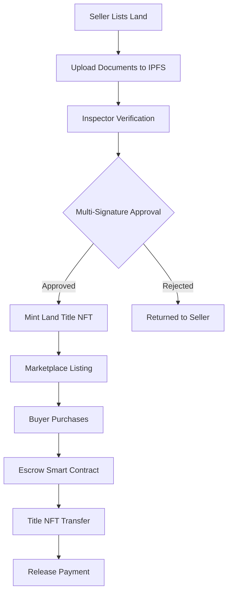

---

# 🏡 BIMA - Decentralized Land Marketplace

> **Mantle Track: Transforming Land Ownership in Africa through Blockchain**

[](https://www.mantle.xyz)
[](LICENSE)
[](https://github.com/your-username/bima)
[](https://github.com/your-username/bima/actions)

---

## 📋 Project Documentation

* **📊 Pitch Deck**: [View Our Presentation](https://docs.google.com/presentation/d/1cGslZ-suI-Kgur_XwWNqFPYfhM8tAo6ANXRfOSw60us/edit?usp=sharing)
* 📊 **Live Project**: [https://drive.google.com/file/d/17_noJiC_8n-TCQZ94j4F2uLRVRN9EBHa/view?usp=sharing)
* 📊 **Project Whitepaper**: [https://app.gitbook.com/invite/Re8U2LJlijqo242e16Eq/FQNutGDFOT8FpslNIAHr](https://app.gitbook.com/invite/Re8U2LJlijqo242e16Eq/FQNutGDFOT8FpslNIAHr)

---

# 🚀 Quick Start Guide

## Run the App Locally

### 1. Clone and Install
```bash
git clone https://github.com/Irenenditi/Mantle-bima.git
cd bima
cd frontend
npm install
npm run dev
```

### 2. backend Set Up Environment
```bash
cd backend
npm install
npm start
# Edit .env.local with your keys (see below)
```

### 3. Run the Development Server
```bash
npm run dev
```
Open [http://localhost:3000](http://localhost:3000) in your browser.

## 🔧 Required Environment Variables
Add these to your `.env.local`:
```env
# Mantle Network
NEXT_PUBLIC_MANTLE_RPC_URL=https://rpc.testnet.mantle.xyz
NEXT_PUBLIC_MANTLE_CHAIN_ID=5001
NEXT_PUBLIC_CONTRACT_ADDRESS=your_contract_address_here
```

## 📦 Production Build
```bash
npm run build
npm start
```

## 🌐 Live Demo
Check out our live deployment: [https://bima-mantle.vercel.app](https://bima-mantle.vercel.app)

## 🐛 Need Help?
```bash
# Check for common issues
npm run debug

# Reset and clean install
npm run clean:install
```

That's it! Your BIMA marketplace is now running locally. 🎉
## 🌍 Overview

**BIMA** is a decentralized land marketplace that leverages blockchain technology, decentralized identifiers (DIDs), and tokenized land titles to build a transparent, trusted, and community-driven land ecosystem.

Deployed on the **Mantle Network**, BIMA enables individuals, institutions, and local authorities to buy, sell, and verify land ownership securely through **on-chain records, smart escrow contracts, and multi-signature verification** by trusted community inspectors.

> The name **“BIMA”**, derived from the Swahili word for land or property, reflects our mission: empowering individuals to own and trade land with confidence, speed, and transparency.

---

## 🚨 The Problem: Land Ownership Challenges

Land remains one of the most valuable yet problematic assets in emerging economies:

| Challenge                         | Impact                                             |
| --------------------------------- | -------------------------------------------------- |
| **Fraudulent & Duplicate Titles** | Paper-based or corrupted registries enable fraud   |
| **Bureaucratic Processes**        | Lengthy verification and transfer procedures       |
| **Low Trust Ecosystems**          | Distrust between landowners, buyers, and officials |
| **Lack of Accountability**        | Unreliable surveyors and land officers             |
| **Opacity in Records**            | Limited public access to verified ownership data   |

**Result:** frequent land disputes, loss of property rights, and reduced investment confidence.

---

## 🎯 Our Solution

BIMA creates a secure, user-friendly digital marketplace where land transactions are governed by **smart contracts on Mantle**, rather than opaque bureaucratic intermediaries.

### 🔄 How BIMA Works



---

## 🛠️ Tech Stack

### 🧠 Languages & Frameworks


### 🌐 Mantle & Web3


### 🧰 Development Tools


---


## 🔗 Mantle Integration Deep Dive

### ERC-721 Land Title NFTs

BIMA tokenizes verified land parcels as **ERC-721 NFTs deployed on Mantle**. Each NFT represents a unique land title with immutable ownership history and IPFS-hosted documentation.

### On-Chain Verification & Transparency

All inspector approvals, escrow actions, listings, and title transfers are logged as **public Mantle transactions**, enabling full auditability via Mantle explorers.

### Smart Contracts (Solidity)

* Land Title NFT Contract
* Inspector Registry (multi-signature approvals)
* Escrow Contract for buyer–seller protection

---

## 🏗️ System Architecture

```
┌─────────────────┐    ┌──────────────────┐    ┌─────────────────┐
│   Frontend      │    │   Backend API    │    │ Mantle Network  │
│ React / Next.js │◄──►│ Node.js / Express│◄──►│ Solidity Smart  │
│ Ethers.js       │    │ IPFS Gateway     │    │ Contracts       │
└─────────────────┘    └──────────────────┘    └─────────────────┘
```

---

## 🖥️ Platform Features & UI Showcase

### 🏠 Landing Page & User Onboarding


 
 


 

### 🎟️ Land Title Minting Interface


### 🏡 Land Listing & Marketplace


### 📝 Land Listing Creation


### 🔍 Inspector Verification Portal


---

## ✨ Key Features

* Tokenized land titles (ERC-721)
* Inspector-based multi-signature verification
* Escrow-protected purchases
* DID-based identities
* Public, immutable on-chain audit trail
* Low transaction fees via Mantle

---

## 📊 Project Status

* ✅ Smart contracts deployed on Mantle Sepolia
* ✅ Frontend MVP completed
* ✅ Inspector verification flow implemented
* 🔄 User testing ongoing

---


## 👨‍💻 Team

| Name          | Role                     | Contact                                                           |
| ------------- | ------------------------ | ----------------------------------------------------------------- |
| John Mokaya   | Frontend Developer       | [mokayaj857@gmail.com](mailto:mokayaj857@gmail.com)               |
| Mary Njoroge  | Project Manager          | [mariannapeters203@gmail.com](mailto:mariannapeters203@gmail.com) |
| Irene Njoroge | Smart Contract Developer | [irenenditi1@gmail.com](mailto:irenenditi1@gmail.com)             |
| Joseph Okumu  | Backend Developer        | [jokumu25@gmail.com](mailto:jokumu25@gmail.com)                   |

---

<div align="center">

**Built with ❤️ on Mantle Network**
*Transforming African Land Ownership — One Verified Title at a Time*

</div>

---

